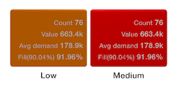
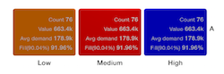
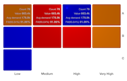
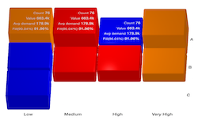

# 3DGraph
An interactive Swift 3D Graph. Simple, very easy to setup and use.

#### Installation
- Copy `BarNode.swift`, `LabelNode.swift`, `GraphNode.swift`, `BarElement.swift` and `GraphView.swift` to your project.

#### Usage

Add a UIView to storyboard or xib and assign a subclass of `GraphView` (you can also create GraphView in code)
Allocate the required constraints should be necessary and appropriate measures according to our needs.
The next step would be a sight IBOutlet to assign attributes and data.
Once these steps, we pass the data we want to show in the graph, it is an array of `BarElement` (`[BarElement]`)


```swift

//Create `BarElement`

let bar1 = BarElement(width: 200, height:150, length: 200, color: UIColor.orangeColor(), cornerRadius: 2.5)
let bar2 = BarElement(width: 200, height: 150, length: 150, color: UIColor.redColor(), cornerRadius: 2.5)
let bar3 = BarElement(width: 200, height: 150, length: 180, color: UIColor.blueColor(), cornerRadius: 2.5)

// Optionally you can add labels to the bar element, it needs to be ann array of AttributedString
var label1 = NSMutableAttributedString(string: "Count 76")
label1.addAttributes([NSFontAttributeName: UIFont.systemFontOfSize(4), NSForegroundColorAttributeName: UIColor.whiteColor()], range: NSMakeRange(0, 5))
label1.addAttributes([NSFontAttributeName: UIFont.boldSystemFontOfSize(4.5)], range: NSMakeRange(5, label1.length-5))
        
var label2 = NSMutableAttributedString(string: "Value 663.4k")
label2.addAttributes([NSFontAttributeName: UIFont.systemFontOfSize(4), NSForegroundColorAttributeName: UIColor.whiteColor()], range: NSMakeRange(0, 5))
label2.addAttributes([NSFontAttributeName: UIFont.boldSystemFontOfSize(4.5)], range: NSMakeRange(5, label2.length-5))
        
var label3 = NSMutableAttributedString(string: "Avg demand 178.9k")
label3.addAttributes([NSFontAttributeName: UIFont.systemFontOfSize(4), NSForegroundColorAttributeName: UIColor.whiteColor()], range: NSMakeRange(0, 10))
label3.addAttributes([NSFontAttributeName: UIFont.boldSystemFontOfSize(4.5)], range: NSMakeRange(10, label3.length-10))
        
var label4 = NSMutableAttributedString(string: "Fill(90.04%) 91.96%")
label4.addAttributes([NSFontAttributeName: UIFont.systemFontOfSize(4), NSForegroundColorAttributeName: UIColor.whiteColor()], range: NSMakeRange(0, 12))
label4.addAttributes([NSFontAttributeName: UIFont.boldSystemFontOfSize(4.5)], range: NSMakeRange(12, label4.length-12))

bar1.labels = [label1, label2, label3, label4]
bar2.labels = [label1, label2, label3, label4]
bar3.labels = [label1, label2, label3, label4]
```

To display the bar elements add it to garElements property of graphView:

```swift
class ViewController: UIViewController {

    @IBOutlet weak var graphView: GraphView!
    
    
    override func viewDidAppear(animated: Bool) {
        super.viewWillAppear(animated)
        
        graphView.barElements = [bar1, bar2, bar3]
        graphView.selectedItemHandler = {
            idx in
            println("Item \(idx) pressed")
        }
    }
}
```
##### Customize
```swift
graphView.columns = 4         // Columns in single row
graphView.offset = CGPoint(x: 0, y: -60)  // Let you move the graph inside the view
graphView.labelOffset = CGPoint(x: -10, y: 5)  // Let you move the labels inside bar element
graphView.rotAngleX = -60  // Rotation in degrees for animation after user tap the graph around X axis
graphView.rotAngleY = -18  // Rotation in degrees for animation after user tap the graph around Y axis
graphView.rotateAtTapEnabled = true  // Enable rotation of the graph view on touch
graphView.selectedItemHandler: ((Int) -> ())?  // Handler which is triggered after user touch bar element
graphView.horizontalSpace = 2  // horizontal space between bar elements
graphView.verticalSpace = 2  // vertical space between bar elements
graphView.xAxisLabels  // Set the X Axis labels on the top/bottom of the graph. It's array of NSAttributedString
graphView.yAxisLabels  // Set the Y Axis labels on the left/right of the graph. It's array of NSAttributedString
graphView.xLabelsOnTop = true  // Set the position of xAxisLabels (top/bottom)
graphView.yLabelsOnLeft = true  // Set the position of yAxisLabels (left/right)
```

##### Preview Image

<!--
-->





